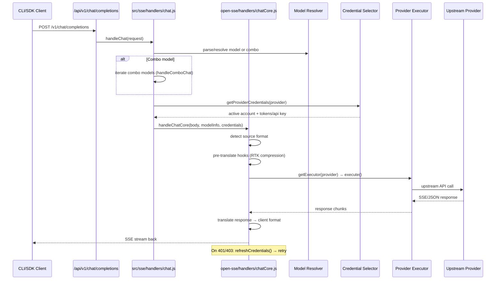

# 9Router Repository Guide

_How this repository works — architecture, request flow, key modules, and development conventions._

For an at-a-glance, human-oriented visual walkthrough, see [Developer Map](docs/DEVELOPER_MAP.md).

---

## Table of Contents

- [What is 9Router?](#what-is-9router)
- [Repository Structure](#repository-structure)
- [Architecture Overview](#architecture-overview)
- [Request Lifecycle](#request-lifecycle)
- [Core Modules](#core-modules)
- [Translator Engine](#translator-engine)
- [Provider Registry](#provider-registry)
- [Persistence Layer](#persistence-layer)
- [CLI Launcher](#cli-launcher)
- [Testing](#testing)
- [Conventions & Gotchas](#conventions--gotchas)
- [Development Commands](#development-commands)

---

## What is 9Router?

9Router (`9router-app`) is a **local AI routing gateway + Next.js dashboard**. It exposes one OpenAI-compatible endpoint (`/v1/*`) and routes traffic across 40+ upstream providers with:

- **Format translation** — OpenAI ↔ Claude ↔ Gemini ↔ Kiro ↔ Cursor ↔ more
- **Model combo fallback** — multi-model sequence with automatic failover
- **Multi-account fallback** — round-robin across accounts per provider
- **RTK Token Saver** — auto-compresses `tool_result` content, saving 20–40% tokens
- **OAuth + API-key credential management** — with automatic token refresh
- **Quota/usage tracking** — per-model cost tracking and request logging
- **Optional cloud sync** — multi-device state synchronization

---

## Repository Structure

```
9router/
├── src/                        # Next.js app + dashboard/compat APIs
│   ├── app/api/                # Next.js app routes (API endpoints)
│   │   ├── v1/                 # OpenAI-compatible API surface
│   │   ├── v1beta/             # Beta compatibility APIs
│   │   ├── auth/               # Dashboard auth (login/session)
│   │   ├── providers*/         # Provider management
│   │   ├── oauth/              # OAuth flows
│   │   ├── keys/               # API key management
│   │   ├── combos/             # Model combo management
│   │   ├── usage/              # Usage tracking
│   │   ├── sync/               # Cloud sync control
│   │   └── settings/           # Dashboard settings
│   ├── sse/                    # App-side SSE glue layer
│   │   ├── handlers/           # chat.js, image.js, embedding.js, etc.
│   │   ├── services/           # model.js, provider.js
│   │   └── utils/              # Stream utilities
│   ├── lib/                    # Shared libraries
│   │   ├── db/                 # SQLite persistence layer
│   │   ├── auth/               # Auth utilities
│   │   ├── oauth/              # OAuth helpers
│   │   └── ...                 # Other utilities
│   └── shared/                 # Cross-cutting utilities
│
├── open-sse/                   # Provider-agnostic routing/translation engine
│   ├── config/                 # Constants, provider defs, model configs
│   ├── executors/              # Per-provider upstream call adapters
│   ├── handlers/               # Per-modality core handlers (chat, image, etc.)
│   ├── providers/              # Provider registry + capabilities
│   ├── rtk/                    # Request Token Killer (tool_result compression)
│   ├── services/               # Model resolution, account fallback, token refresh
│   ├── translator/             # Format conversion (request/response translation)
│   ├── transformer/            # Response format transformers
│   └── utils/                  # Stream, SSE, error handling, proxy fetch
│
├── cli/                        # CLI launcher package (published as `9router` on npm)
│   ├── cli.js                  # Entry point
│   ├── src/                    # CLI source
│   ├── hooks/                  # Lifecycle hooks
│   └── scripts/                # Build/pack scripts
│
├── tests/                      # Test suite (vitest, independent ESM package)
│   ├── unit/                   # Unit tests
│   ├── translator/             # Translator tests
│   ├── auth/                   # Auth tests
│   └── __baseline__/           # Regression baselines
│
├── docs/                       # Documentation
│   └── ARCHITECTURE.md         # Full system architecture doc
│
├── scripts/                    # Build/migration scripts
├── custom-server.js            # Custom Next.js server (IP derivation, peer token)
├── next.config.mjs             # Next.js config with /v1/* → /api/v1/* rewrites
├── package.json                # Root package (9router-app)
└── Dockerfile                  # Docker build
```

---

## Architecture Overview

```mermaid
flowchart TD
    subgraph Clients[Developer Tools]
        CC[Claude Code]
        CDS[Codex / Cursor / Cline / Continue]
        BROWSER[Browser Dashboard]
    end

    subgraph9router[9Router Process]
        V1["/v1/* API<br/>(OpenAI-compatible)"]
        DASH["Dashboard + Management<br/>/api/*"]
        SSE["SSE + Translation Core"]
        SQLITE[(SQLite DB)]
        USAGE[(usage.json + log.txt)]
    end

    subgraph Upstreams[Upstream Providers]
        OAUTH[OAuth Providers<br/>Claude, Codex, Gemini, Kiro, Cursor...]
        APIKEY[API-Key Providers<br/>OpenAI, Anthropic, OpenRouter, GLM...]
        COMPAT[Compatible Nodes<br/>OpenAI/Anthropic-compatible]
    end

    CC --> V1
    CDS --> V1
    BROWSER --> DASH

    V1 --> SSE
    DASH --> SQLITE
    SSE --> SQLITE
    SSE --> USAGE

    SSE --> OAUTH
    SSE --> APIKEY
    SSE --> COMPAT
```

### Two Published Artifacts

| Artifact | Location | npm Package | Purpose |
|---|---|---|---|
| Dashboard + Gateway | Root (`package.json`) | `9router-app` | Next.js server that does the actual routing |
| CLI Launcher | `cli/` | `9router` | Installs/starts the server, manages the system tray |

Both are versioned independently.

---

## Request Lifecycle

When a client sends a request to `/v1/chat/completions`:



### Step-by-step breakdown

1. **Route entry** — Next.js rewrites `/v1/*` → `/api/v1/*` (defined in `next.config.mjs`)
2. **Parse & combo expansion** — `src/sse/handlers/chat.js` parses the request, resolves model name or expands combos
3. **Account selection** — Selects active provider account with credentials (OAuth token or API key)
4. **Core orchestration** — `open-sse/handlers/chatCore.js`:
   - Detects source format (OpenAI, Claude, etc.)
   - Runs pre-translate hooks (RTK token compression, headroom proxy, caveman system inject)
   - Translates request to target provider format
   - Dispatches to provider executor
5. **Executor** — `open-sse/executors/*` makes the upstream API call
6. **Stream translation** — Response chunks are translated back to client format
7. **SSE response** — Streamed back to the client
8. **Error handling** — On 401/403, credentials are refreshed and the request is retried

---

## Core Modules

### `src/sse/` — App-side SSE Glue

The entry layer that lives in the Next.js app. It handles:
- Request parsing and model resolution
- Combo expansion (multi-model sequences)
- Account selection and credential retrieval
- Delegates to `open-sse` for core logic

Key files:
- `handlers/chat.js` — Chat completions entry point
- `handlers/image.js` — Image generation entry point
- `handlers/embedding.js` — Embeddings entry point
- `services/model.js` — Model name parsing and resolution

### `open-sse/` — Provider-Agnostic Routing Engine

The core engine, usable standalone (also published separately). Contains all provider-specific logic.

| Directory | Purpose |
|---|---|
| `config/` | All constants: provider definitions, model configs, runtime settings, token limits |
| `executors/` | Per-provider upstream call adapters. `base.js` is the base class; `default.js` handles any OpenAI-compatible provider |
| `handlers/` | Per-modality core handlers (chat, image, embedding, TTS, STT, search) |
| `providers/` | Provider registry + capabilities + pricing |
| `rtk/` | Request Token Killer — compresses `tool_result` content in-place to save tokens |
| `services/` | Model resolution, provider lookup, account fallback, combo logic, token refresh, OAuth credential management |
| `translator/` | Format conversion between client and provider formats |
| `transformer/` | Response format transformers (e.g., Chat Completions → Codex Responses API) |
| `utils/` | Stream handling, SSE parsing, error utilities, proxy fetch, client detection |

---

## Translator Engine

The translator converts requests and responses between different AI provider formats.

### How it works

- **Pivots through OpenAI as the intermediate format** — most translations go: `client format → OpenAI → provider format`
- **Direct routes** — for fragile pairs (e.g., Claude ↔ Kiro), a translator registered on the exact `source:target` pair skips the lossy double-hop
- **Self-registration** — translators call `register(from, to, reqFn, resFn)` as an import side-effect
- **MUST be imported** — new translator files must be imported in `open-sse/translator/index.js` or they'll never run

### Directory structure

```
open-sse/translator/
├── index.js              # Registry entry — imports all translators
├── request/              # Request translators (from-to-to.js)
├── response/             # Response translators (from-to-to.js)
├── schema/               # Enums: ROLE, CLAUDE_BLOCK, etc.
├── concerns/             # Shared translation logic
├── formats.js            # Format definitions
└── formats/              # Per-format handlers
```

### Adding a new translator

1. Create `request/<from>-to-<to>.js` calling `register(...)`
2. Create `response/<from>-to-<to>.js` calling `register(...)`
3. Import both in `translator/index.js`
4. Reuse `schema/` and `concerns/` — don't re-implement parsing

---

## Provider Registry

Providers are defined in `open-sse/providers/registry/` — one file per provider.

### Structure

```
open-sse/providers/
├── registry/
│   ├── index.js          # Auto-generated static import list (DO NOT hand-edit)
│   ├── openai.js
│   ├── anthropic.js
│   ├── google.js
│   └── ...
├── REGISTRY_TEMPLATE.js  # Template for new providers
├── capabilities.js       # Provider capability definitions
└── pricing.js            # Pricing data
```

### Adding a new provider

1. Copy `providers/REGISTRY_TEMPLATE.js` → `providers/registry/{id}.js`
2. Add models to `config/providerModels.js`
3. Regenerate `registry/index.js` using `scripts/migrate-registry.mjs` or `injectDisplayToRegistry.mjs`
4. Only add a custom executor if the provider is NOT OpenAI-compatible (most are handled by `DefaultExecutor`)

### Executor pattern

- `BaseExecutor` in `executors/base.js` — override `getBaseUrls`, `buildHeaders`, `buildUrl`, `execute`
- `DefaultExecutor` handles any OpenAI-compatible API (used for most providers)
- `getExecutor(provider)` falls back to `DefaultExecutor` when no custom executor exists

---

## Persistence Layer

### SQLite Database (primary state)

Located at `src/lib/db/` with an adapter fallback chain:

| Priority | Driver | Notes |
|---|---|---|
| 1 | `bun:sqlite` | Bun runtime native |
| 2 | `better-sqlite3` | Optional native dep (in `optionalDependencies`) |
| 3 | `node:sqlite` | Node ≥22.5 native |
| 4 | `sql.js` | Pure-JS fallback, always works |

- **DB file location**: resolves via `src/lib/db/paths.js` (`DATA_DIR` env, else `~/.9router/`)
- **Shim**: `src/lib/localDb.js` re-exports `src/lib/db/index.js` for backward compat
- **Repos**: per-entity logic lives in `src/lib/db/repos/*`
- **Migrations**: schema/migrations in `src/lib/db/migrations/`

### Usage/Logs

- `src/lib/usageDb.js` — usage tracking
- Files: `~/.9router/usage.json` + `~/.9router/log.txt`
- **Does NOT follow `DATA_DIR`** — always under `~/.9router/`

### Entities stored

- Provider connections (credentials, OAuth tokens, API keys)
- Provider nodes (upstream endpoints)
- Model aliases (custom name → provider/model mappings)
- Combos (multi-model fallback sequences)
- API keys (for dashboard access)
- Settings (dashboard configuration)
- Pricing (per-model cost data)

---

## CLI Launcher

The `cli/` directory is a separate npm package (`9router`) that:

- Installs and starts the9router server
- Manages the system tray icon
- Handles auto-updates

It has its own `package.json`, version, and build process, independent of the root package.

---

## Testing

Tests live in `tests/` as an independent ESM package using **vitest**.

### Running tests

```bash
# Install root deps first
npm install

# Then install test deps
cd tests && npm install

# Run all tests
npx vitest run

# Run single file
npx vitest run unit/capabilities.test.js
```

### Test structure

```
tests/
├── unit/                   # Unit tests
├── translator/             # Translator format tests
│   └── real/               # Live provider tests (need credentials)
├── auth/                   # Auth tests
└── __baseline__/           # Regression baselines
    ├── known-fails.txt     # Catalogued known failures
    └── verify-*.mjs        # Regression check scripts
```

### Important notes

- The suite is **NOT expected to be all-green** on a plain checkout (~938 pass, ~64 fail)
- Judge regressions with `tests/__baseline__/verify-no-regression.mjs`, not raw test runs
- `*.real.test.js` make live provider calls — skip unless credentials are set
- Regression baselines should be run after touching provider registry or alias logic

---

## Conventions & Gotchas

### Language & Style

- **Plain JavaScript (ESM)** — no TypeScript
- `@/*` path alias maps to `src/*` (configured in `jsconfig.json`)
- Lint: `npx eslint .` (config: `eslint.config.mjs`)

### Security

- `custom-server.js` derives client IP from TCP socket, stripping attacker-controlled `X-Forwarded-For`
- Sensitive env vars: `JWT_SECRET`, `INITIAL_PASSWORD` (default `123456`), `API_KEY_SECRET`, `MACHINE_ID_SALT`
- Full env contract in `.env.example` and `docs/ARCHITECTURE.md`

### Translator Engine

- **Pivots through OpenAI** as intermediate format — lossy for thinking blocks, non-base64 images, tool IDs, `is_error`
- Prefer **direct routes** for fragile pairs
- Never hardcode role/block/model strings — use `config/` and `schema/` constants

### Provider Registry

- `registry/index.js` is **auto-generated** — regenerate with `scripts/migrate-registry.mjs`, don't hand-edit
- Binary/protobuf upstreams (Kiro EventStream, Cursor protobuf, CommandCode NDJSON) don't round-trip through OpenAI — handled in their own executor

### RTK Token Saver

- `open-sse/rtk/` compresses `tool_result` content in-place to cut tokens
- **Fail-open**: any error returns null and leaves the body untouched — never throws
- Skips `is_error`/`status:"error"` results to preserve error traces

### Versioning

- Root and `cli/` are versioned independently
- Changes logged in `CHANGELOG.md`
- Commit style: Conventional Commits (`fix(translator): …`, `feat(...)`)

---

## Development Commands

### Dashboard/Gateway (run from repo root)

```bash
# Setup
cp .env.example .env
npm install

# Development (webpack, port 20127 by default)
PORT=20128 NEXT_PUBLIC_BASE_URL=http://localhost:20128 npm run dev

# Production build + start
npm run build && PORT=20128 HOSTNAME=0.0.0.0 npm run start

# Bun variants
npm run dev:bun
npm run build:bun
npm run start:bun
```

### CLI Package

```bash
npm run cli:pack       # Build + npm pack from root
cd cli && npm run dev  # Nodemon watch mode
```

### Docker

```bash
docker build -t9router .
docker run -p 20128:201289router
```

See `DOCKER.md` for detailed Docker instructions.

---

## Further Reading

- `docs/ARCHITECTURE.md` — Full system architecture (data model, deployment topology, failure modes, security boundaries)
- `open-sse/AGENTS.md` — Translator engine conventions and how to add providers/executors/translators
- `CHANGELOG.md` — Version history and changes
- `README.md` — User-facing documentation and quick start guide
